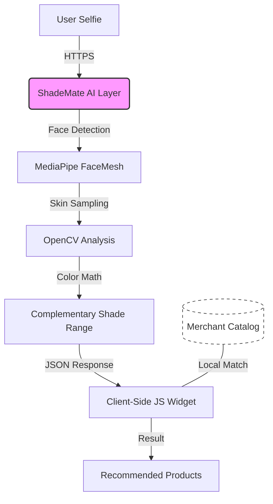

# ShadeMate AI Layer 🎨✨


**Premium Skin Tone Analysis & Complementary Shade Recommendation Engine.**

---

## 📐 Architecture & Privacy Flow

ShadeMate is built on a **Zero-Knowledge Architecture**. The merchant's catalog never touches our servers, ensuring 100% data privacy.



---

## 🚀 Key Features

- **AI-Powered Face Detection**: Uses MediaPipe Tasks for robust, cross-platform facial landmarking.
- **Precision Sampling**: 3-region skin sampling (forehead + cheeks) for accurate LAB color extraction.
- **Privacy-First Architecture**: Stateless design. No images or face data are ever stored or logged.
- **Zero-Knowledge Matching**: The AI returns color ranges; the actual product matching happens on the client side.
- **Multi-Platform Support**: Ready for Shopify, WooCommerce, and Custom Headless builds.
- **Security**: Built-in API Key validation and Domain-Locking (Origin Protection).

---

## 🛠️ Tech Stack

- **Backend**: FastAPI (Python 3.12)
- **Computer Vision**: MediaPipe, OpenCV, NumPy
- **Deployment**: Optimized for Render.com / Railway / Docker
- **Integration**: Vanilla JS (No dependencies)

---

## 🚦 Quick Start

### 1. Local Development
```bash
# Install dependencies
pip install uv
uv sync

# Set environment variables
$env:VALID_API_KEYS="your-key"
$env:API_KEY_DOMAINS="your-key:*"

# Run the server
uv run uvicorn main:app --reload
```

### 2. Onboarding Products
Use the internal utility to convert your product HEX codes to AI-ready LAB values:
```bash
uv run python utils/onboard_catalog.py
```

---

## 🔌 API Reference

### `GET /health`
Liveness probe to verify service status.

### `POST /analyze`
The core AI endpoint.
- **Headers**: `Authorization: Bearer <your-key>`
- **Body**: `multipart/form-data` with `image` (file).
- **Returns**: Detected skin tone (LAB/HEX/Undertone) and 5 complementary shade variants.

---

## 🎨 Frontend Integration

ShadeMate provides a premium "Drop-in" widget for merchants.

```html
<script 
  src="https://cdn.shademate.ai/widget.js" 
  data-api="https://your-api.onrender.com" 
  data-key="your-api-key">
</script>
```

---

## 📄 License
Internal Property of ShadeMate. All Rights Reserved.
